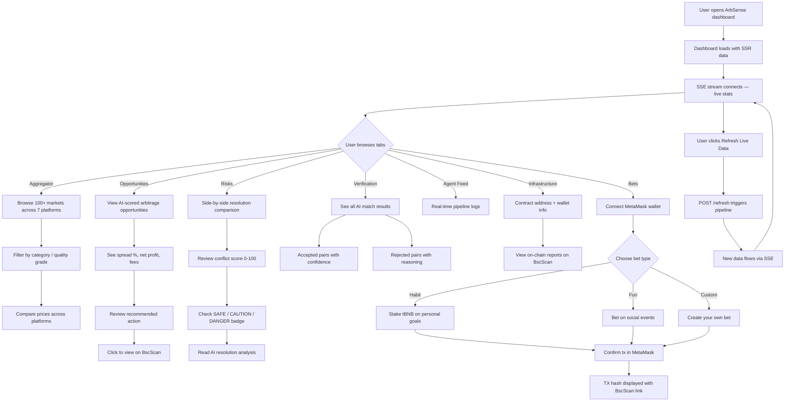
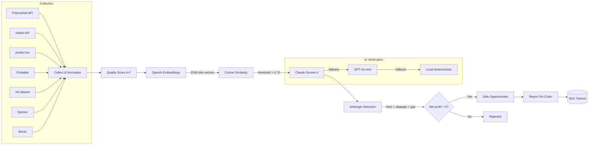
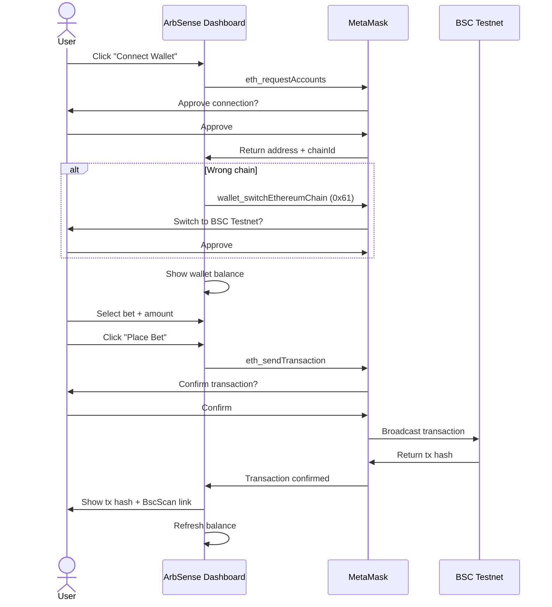
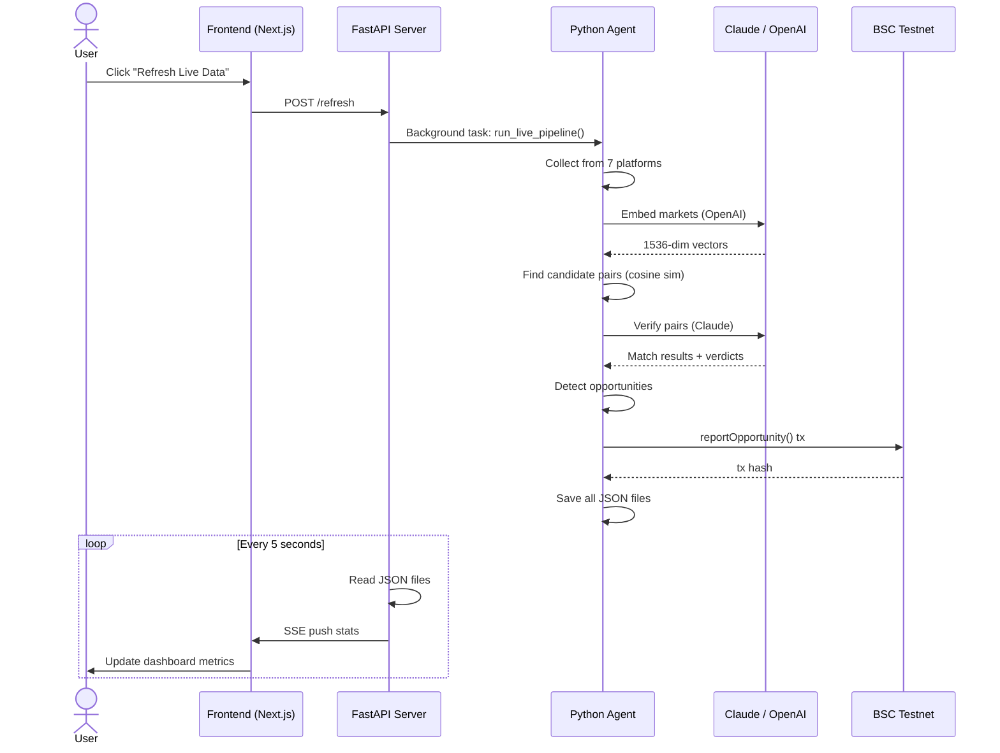

# User Journey

## 1. Core User Flow — Arbitrage Discovery

## 2. Intelligence Pipeline Flow

## 3. Wallet Connection Flow (Bets Tab)

## 4. Data Refresh Flow

## 5. UX Improvements Over Existing Tools

| Existing Tool Pain Point | ArbSense Solution |
|--------------------------|-------------------|
| Manual platform-by-platform browsing | Single aggregated view of 7 platforms |
| No resolution criteria comparison | Side-by-side AI-powered risk analysis |
| Price-only arbitrage (misses traps) | Semantic matching + resolution verdict |
| No audit trail | Immutable on-chain proof on BSC |
| Static dashboards | Real-time SSE streaming + live refresh |
| No personal betting | Habit builder + fun bets with MetaMask |
| Complex interfaces | Clean monochrome UI with tab navigation |
