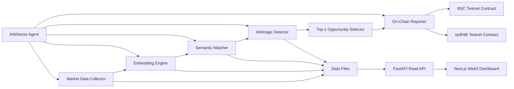

# ArbSense System Architecture

## Components

- Market Data Collector: Normalizes prediction markets into a shared schema from live connectors or curated sample snapshots.
- Embedding Engine: Converts market text into vectors and finds cross-platform candidate pairs using cosine similarity.
- Semantic Matcher: Uses LLM reasoning (Anthropic primary, OpenAI fallback) to confirm if two markets describe the same event.
- Arbitrage Detector: Computes spread and net profitability with fee, slippage, and gas adjustments.
- Top-1 Opportunity Selector: Keeps one best opportunity per cycle to reduce reporting gas and execution complexity.
- On-Chain Reporter: Submits selected opportunities to `ArbSenseRegistry` on BSC/opBNB testnet.
- FastAPI Read API: Serves JSON artifacts from the intelligence pipeline for frontend consumption.
- Next.js Dashboard: Web3-style interface with tabs for aggregator, safe opportunities, resolution risks, AI analysis, agent feed, and on-chain status.
