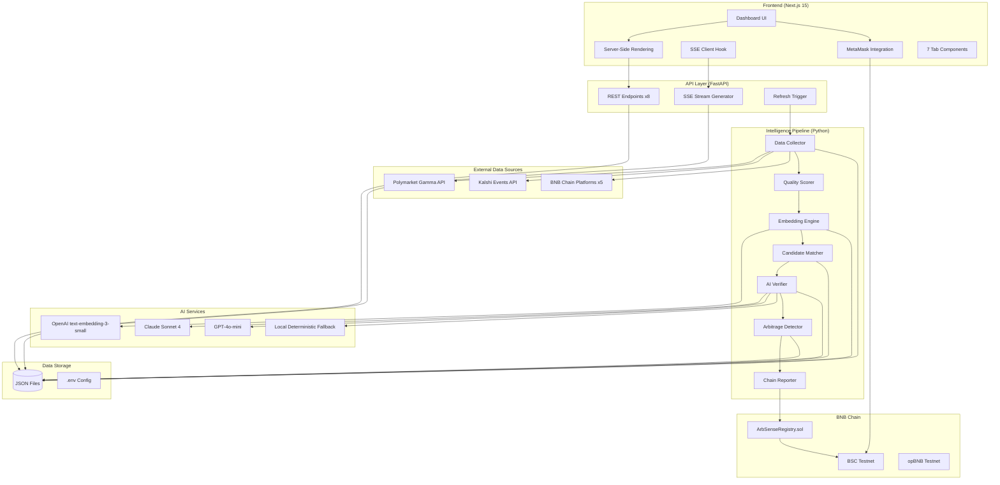
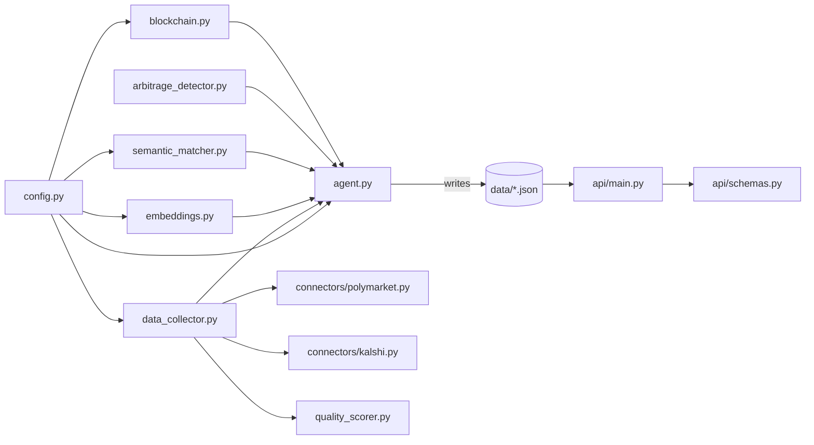
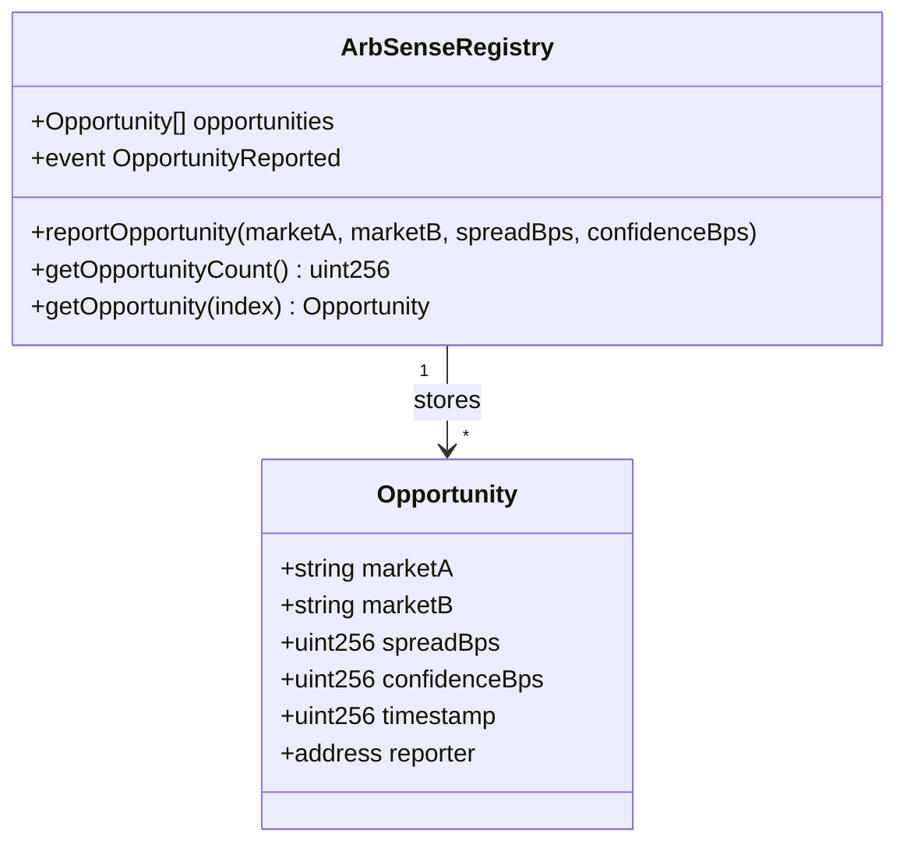
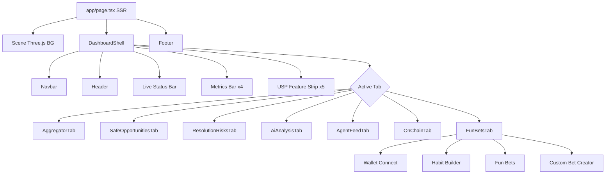
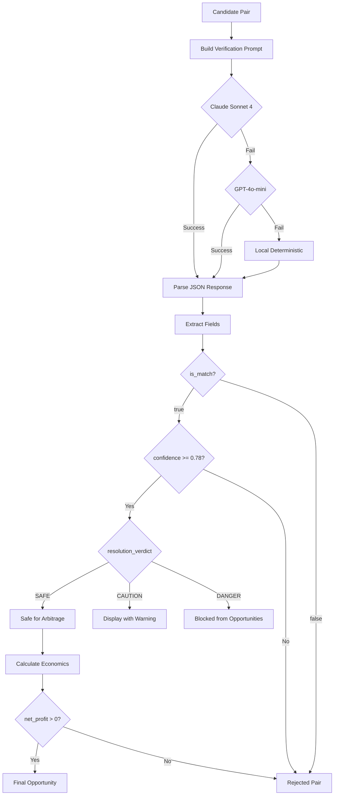
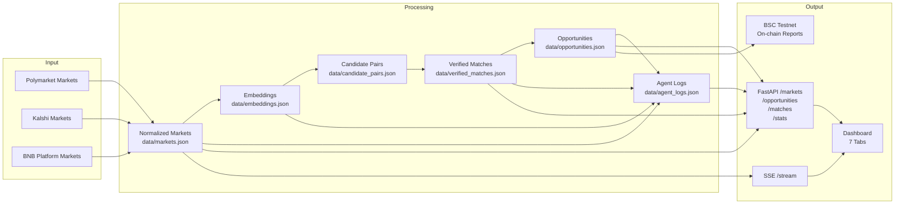
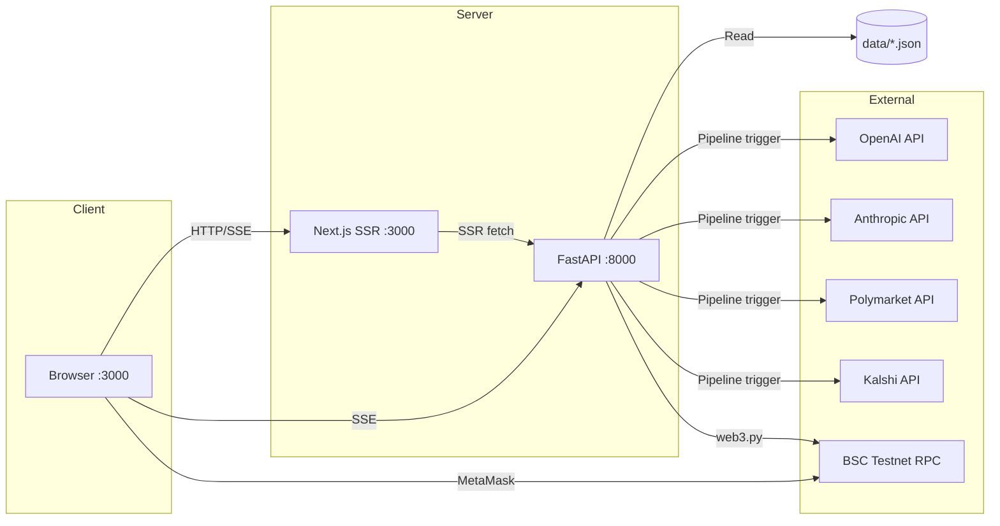
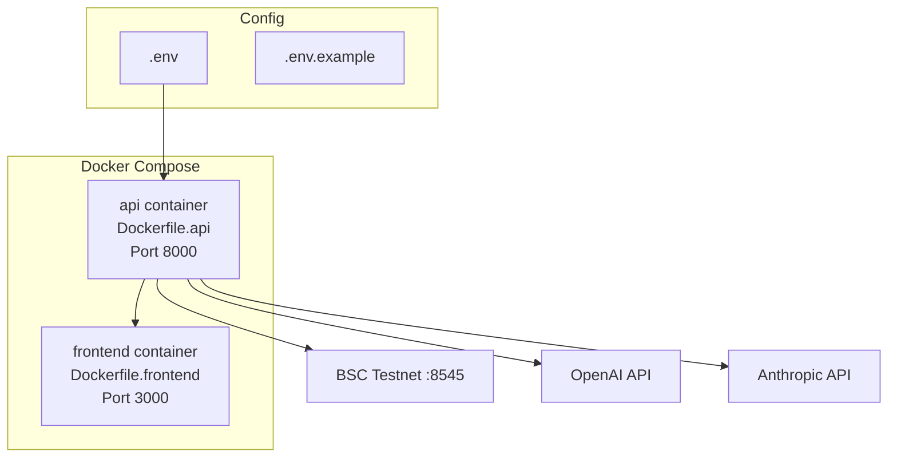

# System Architecture

## High-Level Architecture

## Module Dependency Graph

## Smart Contract Architecture

## Frontend Component Tree

## AI Verification Pipeline Detail

## Data Flow Diagram

## Network Architecture

## Deployment Architecture

