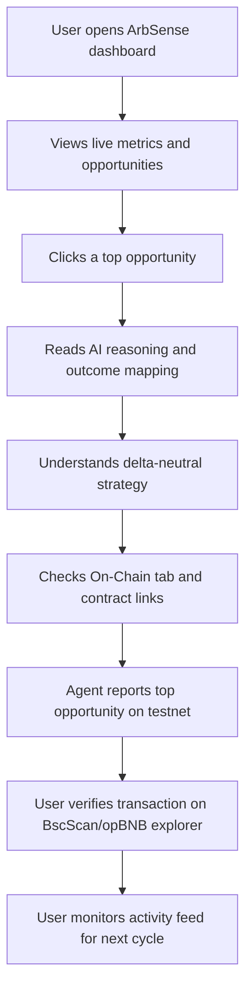

# ArbSense User Journey

## Journey Notes

- The primary "wow moment" is the AI reasoning panel that explains why two differently worded markets are equivalent.
- The dashboard focuses on fast decision support: spread, net profit, confidence, and a clear recommended action.
- On-chain reporting provides auditability and demonstrable BNB ecosystem integration for judging.
